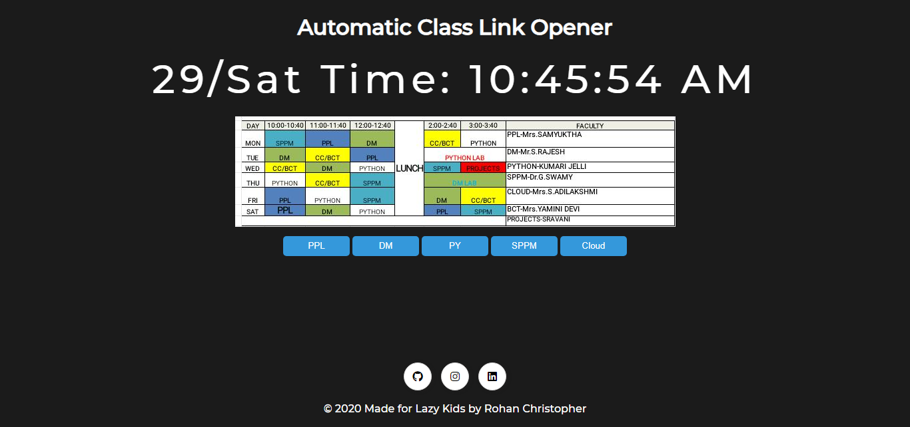
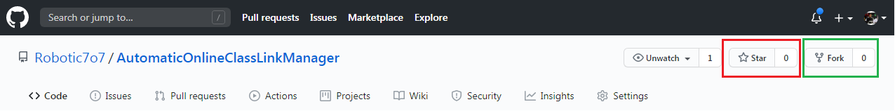

# Automatic Zoom Class Link Opener

<iframe src="https://giphy.com/embed/J1Y6d5pCHv9JPW8VSM" width="100%" height="100%" style="position:absolute" frameBorder="0" class="giphy-embed" allowFullScreen></iframe>

<a href="https://giphy.com/gifs/J1Y6d5pCHv9JPW8VSM">via GIPHY</a>

> Automatic Online Class Link Manager - To automatically open my zoom class links according to my time table.

---

### Table of Contents

You're sections headers will be used to reference location of destination.

- [Description](#description)
- [How To Use](#how-to-use)

---

## Description

Automatic Online Class Link Manager - To Automatically open my zoom class links according to my time table.

#### Technologies

- HTML, CSS
- JavaScript

[Back To The Top](#read-me-template)

---

## How To Use

#### Run The Website

- Website - [Demo](https://robotic7o7.github.io/AutomaticOnlineClassLinkManager/index.html)

> On the first run don't forget to unblock popups on your browser. Give popup permissions by following this video.

<iframe src="https://giphy.com/embed/SVBxVhXJanOkkI3Fot" width="100%" height="100%" style="position:absolute" frameBorder="0" class="giphy-embed" allowFullScreen></iframe>

<a href="https://giphy.com/gifs/SVBxVhXJanOkkI3Fot">via GIPHY</a>

- If due to some reason, the class does not start up check the timetable and click the corresponding subject button to trigger the zoom class to begin.

- Like the project? Don't forget to star the Repo or Fork it to customize your version.

[Back To The Top](#read-me-template)

---
